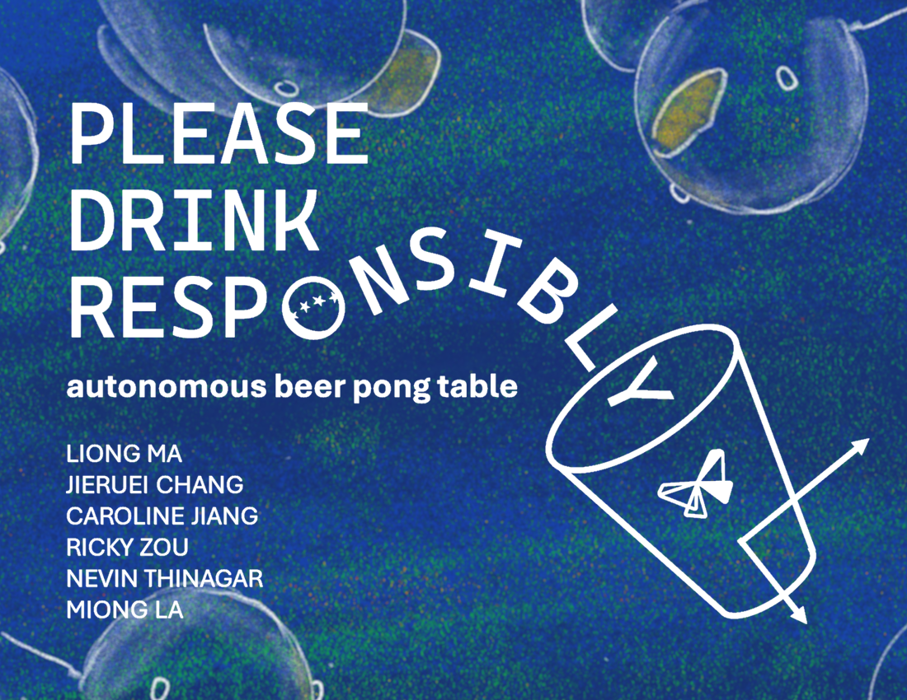

*Built for Formlabs Hackathon 2025*

Video: https://www.youtube.com/watch?v=siTKeD5VCkQ

Meet our protagonist Liong Ma. Liong Ma is the WOAT at beer pong: the worst of all time. However, his evil twin Miong La is the GOAT at beer pong. Thus, our team of heroes has banded together with one goal: help Liong Ma defeat the evil Miong La. To this end, we have constructed a beer pong robot that magnetically moves the cups on a table to assist our valiant yet unskilled hero while confounding his more accomplished evil twin. 

A single-axis or two-axis gantry mounted underneath the table moves a carriage with neodymium magnets. This allows it to move cups on the top of the table (that also have magnets mounted inside of them). A vision system allows for ping-pong ball tracking and trajectory estimation. We are working on implementing stereo vision with epipolar geometry to more accurately track the ball in 3D space.

Potential practical applications of this magnetic gantry system could allow for assistance for the elderly or disabled in accessing space or objects they may not be able to access, giving them autonomy in daily tasks such as eating, work, and losing at beer pong. 
